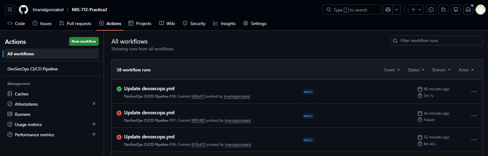
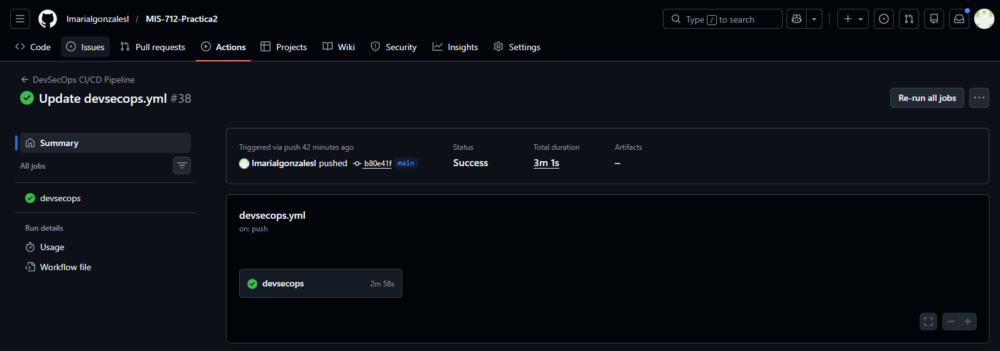

# Documento de Justificación Técnica

## Pipeline CI/CD con Enfoque DevSecOps

El código fuente y el pipeline DevSecOps implementado se encuentran disponibles en el siguiente repositorio público:
**MIS-712-Practica2**  
https://github.com/lmarialgonzalesl/MIS-712-Practica2

## 1. Introducción

El presente documento justifica técnicamente el diseño e implementación
del pipeline CI/CD desarrollado para el repositorio MIS-712-Practica2,
conforme a los requerimientos de la Tarea 2.

El pipeline implementa un enfoque DevSecOps integrando controles
automáticos de calidad, pruebas, seguridad de código, análisis de
dependencias y seguridad de contenedores, garantizando que el código
solo avance si cumple criterios funcionales y de seguridad.

Secuencia implementada:

Code → Build → Test → Security → Container Security → Validation

------------------------------------------------------------------------
## 2. Diseño Global del Pipeline

El pipeline ejecuta las siguientes etapas:

1.  Checkout del repositorio\
2.  Instalación reproducible de dependencias\
3.  Análisis de calidad de código (Lint)\
4.  Testing automático\
5.  Análisis estático de seguridad (SAST)\
6.  Análisis de dependencias (SCA)\
7.  Build de imágenes Docker\
8.  Escaneo de seguridad de contenedores\
9.  Validación mediante Docker Compose

Cada etapa depende del éxito de la anterior, funcionando como un sistema
automático de control.

------------------------------------------------------------------------
## 3. Justificación Técnica por Etapa

### 3.1 Instalación Reproducible

Herramienta: npm ci\
Fase DevSecOps: Build\
Riesgo mitigado: inconsistencias entre entornos y versiones no
controladas.

Se utiliza npm ci para garantizar builds determinísticos usando
package-lock.json. Sin esta práctica podrían existir fallos distintos
entre desarrollo y producción.

------------------------------------------------------------------------
### 3.2 Análisis de Calidad de Código

Herramienta: ESLint\
Fase DevSecOps: Code\
Riesgo mitigado: malas prácticas y errores potenciales.

El análisis estático detecta problemas antes de ejecutar el código. El
pipeline falla si existen errores, actuando como gate automático.

------------------------------------------------------------------------

### 3.3 Testing Automatizado

Herramienta: npm test\
Fase DevSecOps: Test\
Riesgo mitigado: regresiones y funcionalidades rotas.

Las pruebas garantizan que el comportamiento del sistema se mantenga
tras cada cambio. El pipeline se detiene si fallan.

------------------------------------------------------------------------

### 3.4 Seguridad del Código (SAST)

Herramienta: Semgrep\
Fase DevSecOps: Security (Shift Left)\
Riesgo mitigado: vulnerabilidades en código fuente.

Permite detectar patrones inseguros antes del despliegue, reduciendo el
costo de corrección.

------------------------------------------------------------------------

### 3.5 Seguridad de Dependencias (SCA)

Herramienta: GitHub Dependency Review\
Fase DevSecOps: Security\
Riesgo mitigado: vulnerabilidades conocidas (CVEs) en librerías
externas.

Muchas vulnerabilidades provienen de dependencias. Esta herramienta
bloquea PR con riesgos críticos.

------------------------------------------------------------------------

### 3.6 Build de Contenedores

Herramienta: Docker / Docker Buildx\
Fase DevSecOps: Build\
Riesgo mitigado: artefactos inconsistentes y falta de trazabilidad.

Las imágenes se construyen automáticamente y se versionan por SHA,
garantizando reproducibilidad.

------------------------------------------------------------------------

### 3.7 Seguridad de Contenedores

Herramienta: Trivy\
Fase DevSecOps: Security (Container Security)\
Riesgo mitigado: vulnerabilidades en imágenes base y sistema operativo.

Incluso con código seguro, la imagen puede contener CVEs. Trivy detecta
vulnerabilidades críticas.

------------------------------------------------------------------------

### 3.8 Validación de Integración

Herramienta: Docker Compose\
Fase DevSecOps: Validation\
Riesgo mitigado: fallos de integración entre servicios.

Levantar los servicios permite verificar que el sistema completo
funciona correctamente.

------------------------------------------------------------------------

## 4. Gates de Seguridad

El pipeline bloquea automáticamente el avance si:

-   Falla la instalación reproducible.\
-   Falla el lint.\
-   Falla un test.\
-   Se detectan vulnerabilidades críticas en SAST.\
-   Se detectan CVEs críticos en dependencias.\
-   Se detectan vulnerabilidades críticas en imágenes Docker.

Esto demuestra que los controles no son informativos, sino obligatorios.

------------------------------------------------------------------------

## 5. Evidencia de Ejecución del Pipeline

A continuación se muestra evidencia de una ejecución exitosa del pipeline en GitHub Actions, donde todas las etapas fueron completadas correctamente.

### Ejecución exitosa

En esta ejecución se verifica que:

- Todas las etapas fueron ejecutadas.
- No se detectaron vulnerabilidades críticas.
- Los tests pasaron correctamente.
- Las imágenes Docker fueron construidas.
- El escaneo de seguridad de contenedores fue exitoso.
------------------------------------------------------------------------

## 6. Conclusión

El pipeline implementado en MIS-712-Practica2 integra calidad, seguridad
y automatización en todo el ciclo de desarrollo.

Aunque el sistema sea funcional, la funcionalidad no garantiza seguridad
ni estabilidad futura. El enfoque DevSecOps aplicado asegura evolución
controlada, trazable y profesional del software.
